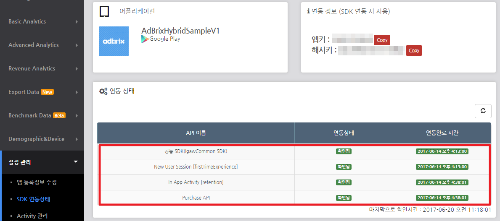
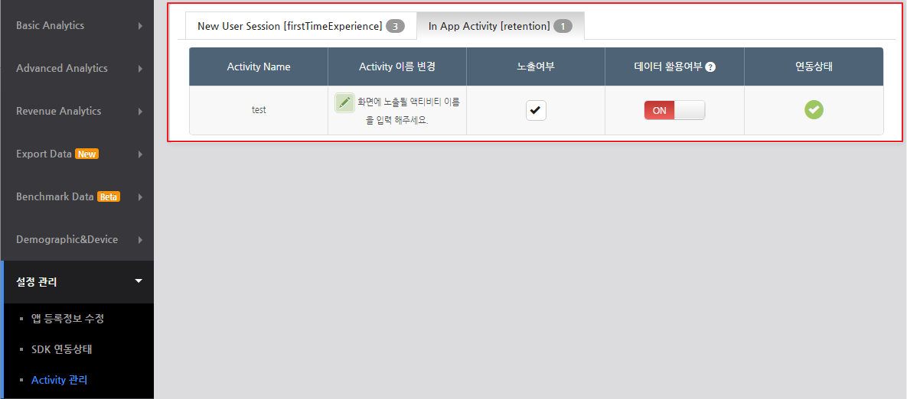

# AdBrixHybridSample


### 애드브릭스 하이브리드 연동 가이드  

본 가이드는 하이브리드 앱에서 애드브릭스 SDK를 호출하기 위한 Javascript Interface 구축을 설명합니다.  
애드브릭스를 연동하는데 필요한 기본적인 연동사항들은 [Help Center](http://help.igaworks.com)를 참고해주세요.  
<br>


------


### 1. WEB PAGE
<br>

### 1.1. For Android 

웹에서 발생한 이벤트 정보를 ANDROID NATIVE 로 전달하여야 합니다.  

~~~javascript
window.[name].[method](var param);
~~~

위와 같은 방식으로 호출하며, 예제에서는 다음과 같이 AdBrix retention api를 호출하였습니다.  

~~~javascript
window.adbrix.retention("sample_data");
~~~

<br>


### 1.2. For iOS

웹에서 발생한 이벤트 정보를 iOS NATIVE 로 전달하여야 합니다.

```javascript
window.location("[name]://[method]?[key]=[param]");
```

위와 같은 방식으로 호출하며, 예제에서는 다음과 같이 AdBrix retention api를 호출하였습니다.

```javascript
window.location("adbrix://ret?activity=sample_data")
```

<br>


------


### 2. ANDROID NATIVE
웹에서 전달한 이벤트를 수신하여 적절한 AdBrix api를 호출합니다.  
webview 에 javascript interface 를 추가하여 웹에서 호출하는 자바스크립트 이벤트를 캐치할 수 있습니다.

~~~java
webView.addJavascriptInterface(adbrixHybridInterface, "adbrix");
~~~

> 위 코드의 "adbrix" 는 자바스크립트의 **window.[name].[method] 의 name과 반드시 동일**해야 합니다.

<br>


### 2.1. DEMO
[[git repository]](./sample_source)에서 안드로이드 프로젝트를 다운로드하여 직접 테스트를 해볼 수 있습니다.   

**필요한것**
+ 앱키, 해시키 [[가이드 확인하기]](http://help.igaworks.com/hc/ko/3_3/Content/Article/app_registration)

<br>

#### 2.1.1. 앱키&해시키 설정
발급받은 앱키, 해시키를 안드로이드 샘플 프로젝트의 AndroidManifest.xml 파일에 세팅합니다.
~~~xml
<meta-data android:name="igaworks_app_key" android:value="input_your_app_key" />
<meta-data android:name="igaworks_hash_key" android:value="input_your_hash_key" />
~~~

<br>

#### 2.1.2. 웹페이지URL 설정
MainActivity.java 파일의 *__HYBRID_SAMPLE_PAGE_URL__* 에 구현한 웹 페이지 주소를 설정합니다.

<br>

#### 2.1.3. 샘플 프로젝트 빌드
프로젝트를 빌드하면 설정한 웹 페이지가 로드되어지고, 이 페이지에서 구현한 이벤트를 발생하여 Javascript Interface를 동작할 수 있습니다.

<br>


------


### 3. iOS NATIVE

웹에서 전달한 이벤트를 수신하여 적절한 Adbrix api를 호출합니다.
UIWebView에 javascript interface를 추가하여 웹에서 호출하는 자바스크립트 이벤트를 캐치할 수 있습니다.

```objective-c
- (BOOL)webView:(UIWebView *)webView shouldStartLoadWithRequest:(NSURLRequest *)request
 navigationType:(UIWebViewNavigationType)navigationType
{
    if ([[[request URL] scheme] isEqualToString:@"adbrix"])
    {
     
        NSString *pFunctionName = [[request URL] host];
        NSDictionary *adbrixEventDict = [self getURLParmaters:[request URL]];
        NSLog(@"parameters : %@", adbrixEventDict);
        
        if([pFunctionName containsString:@"ret"])
        {
            /*!
             @abstract
             retention의 Activity에 해당할때 호출한다.
             
             @param activityName              activity name.(mandatory)
             */
            [AdBrix retention: [adbrixEventDict valueForKey:@"activity"]];
        }
        return NO;
    }
    return YES;
}
```
<br>


### 3.1. DEMO

[[git repository]](./sample_source)에서 안드로이드 프로젝트를 다운로드하여 직접 테스트를 해볼 수 있습니다.   

**필요한것**

- 앱키, 해시키  [[가이드 확인하기]](http://help.igaworks.com/hc/ko/3_3/Content/Article/app_registration)

<br>

#### 3.1.1. 앱키&해시키 설정

발급받은 앱키, 해시키를 안드로이드 샘플 프로젝트의 AppDelegate.m 파일에 세팅합니다.

```objective-c
[IgaworksCore igaworksCoreWithAppKey:@"앱키를_입력하세요" andHashKey:@"해시키를_입력하세요"];
```

<br>

#### 3.1.2. 웹페이지URL 설정

ViewController.m 파일의 *__HYBRID_SAMPLE_PAGE_URL__* 에 구현한 웹 페이지 주소를 설정합니다.

<br>

#### 3.1.3. 샘플 프로젝트 빌드

프로젝트를 빌드하면 설정한 웹 페이지가 로드되어지고, 이 페이지에서 구현한 이벤트를 발생하여 Javascript Interface를 동작할 수 있습니다.

<br>


------


### 4. 연동 확인

<br>

### 4.1. 애드브릭스 어드민에서 확인  

정상적으로 구현되어 전달된 이벤트는 [애드브릭스 -> 설정 관리 -> SDK 연동상태] 메뉴에서 확인할 수 있습니다.  

> 애드브릭스 리포트는 명일 새벽 시간에 확정되어 제공되므로 연동하는 당일에는 확인이 어렵습니다.

<br>

또한 api를 통해서 전달한 세부 액티비티 명은 [애드브릭스 -> 설정 관리 -> Activity 관리] 메뉴에서 확인할 수 있습니다.


<br>
<br>

### 4.2. SDK 로그에서 확인

<br>

#### 4.2.1. ANDROID

안드로이드SDK에서 출력하는 로그를 통해서 정상적으로 데이터가 전달되는지를 확인할 수 있습니다.
+ TAG Filter : IGAW_QA
+ Word Filter(request) : ADBrixTracer, tracking response result
~~~json
"activity_info":[
    {
        "prev_group":"session",
        "prev_activity":"start",
        "group":"ret",
        "activity":"test",
        "param":"",
        "event_id":"6ce8ba8b-a80a-4c4f-87db-51510f45c47c",
        "created_at":"20170620120200"
    }
]
~~~
> ATRequestParameter 로그에서 확인되는 Json String 중에서 activity_info 오브젝트의 내용에 전달한 액티비티 정보가 포함되어있는지를 확인합니다.

<br> 

+ TAG Filter : IGAW_QA
+ Word Filter(response) : ADBrixTracer, tracking response result
~~~json
{
    "BaseTime":1497927723470,
    "IsTest":false,
    "Result":true,
    "ResultCode":1,
    "ResultMsg":"Operation Complete.",
    "Data":{}
}
~~~
> ADBrixTracer 로그에서 확인되는 Json String 중에서 ResultMsg 가 "Operation Complete" 인지를 확인합니다.


<br>

#### 4.2.2 iOS 

iOS SDK에서 출력하는 로그를 통해서 정상적으로 데이터가 전달되었는지를 확인할 수 있습니다.

로그를 확인하기 위해서는 로그 레벨을 설정해야 합니다.

```objective-c
[IgaworksCore setLogLevel:IgaworksCoreLogTrace];
```

> iOS에서는 로그 태그로 필터링하는 것이 어렵습니다. LemonJar에서 배포하는 iOS Console 을 이용하면 보다 쉽게 로그를 검색할 수 있습니다. [iOS Console Download](https://lemonjar.com/iosconsole/)


- LOG FILTER(request) : makeTrackingParameter

```
[IgaworksCoreLib makeTrackingParameter] jsonDict : {
	    "activity_info" =     (
	                {
	            activity = sample_data;
	            "created_at" = 20171110150117;
	            "event_id" = "1250B967-A50A-4880-8A93-26E8364A5D7B";
	            group = ret;
	            param = "";
	            "prev_activity" = "";
	            "prev_group" = "";
	        },
```


- LOG FILTER(response) : tracking

```
[IgaworksCoreLib tracking:]_block_invoke JSON: {
	    BaseTime = 1510293722490;
	    Data =     {
	    };
	    IsTest = 0;
	    Result = 1;
	    ResultCode = 1;
	    ResultMsg = "Operation Complete.";
	}
```

> 로그에서 확인되는 Json String 중에서 ResultMsg가 "Operation Complete"인지를 확인합니다.
